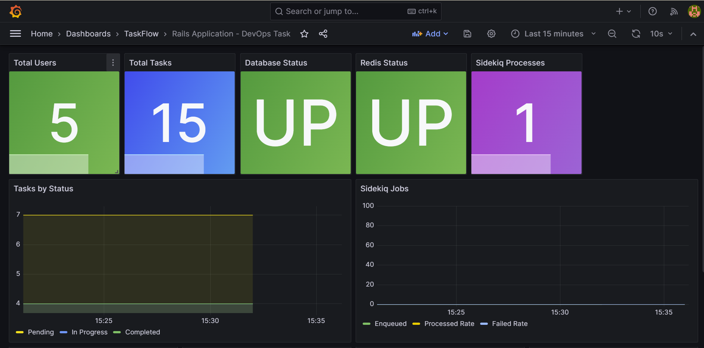
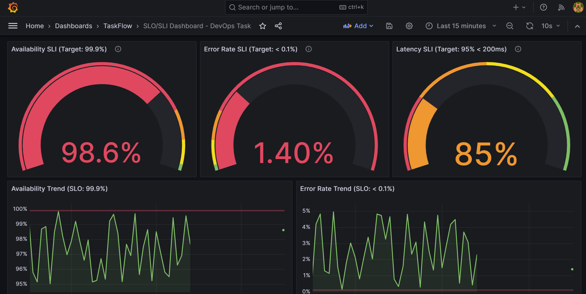

# TaskFlow Platform - Administrator Usage Guide

## Table of Contents

1. [Overview](#overview)
2. [Initial Setup](#initial-setup)
3. [Bastion Host Access](#bastion-host-access)
4. [Database Management](#database-management)
5. [Infrastructure Management](#infrastructure-management)
6. [Monitoring & Alerts](#monitoring--alerts)
7. [Backup & Recovery](#backup--recovery)
8. [Security Operations](#security-operations)
9. [Troubleshooting](#troubleshooting)

---

## Overview

### Architecture Components

| Component | Technology | Purpose | Access Method |
|-----------|-----------|---------|---------------|
| **Bastion Host** | Ubuntu 24.04 + Puppet | Admin access point | SSH tunnel |
| **Database** | PostgreSQL 17 | Data storage | Via bastion or VNet |
| **Container Apps** | Docker + Azure | Application runtime | HTTPS/Azure Portal |
| **Infrastructure** | Terraform | IaC management | GitHub Actions |

### Administrator Responsibilities

✅ **Infrastructure Management** - Deploy and maintain cloud resources
✅ **Database Operations** - Backups, migrations, performance tuning
✅ **Security** - Access control, secrets management, compliance
✅ **Monitoring** - Application health, performance metrics
✅ **Incident Response** - Troubleshooting, root cause analysis

---

## Initial Setup

### 1. Prerequisites

```bash
# Required tools
- Azure CLI (az)
- Terraform >= 1.14.3
- SSH client
- kubectl (optional)
- jq (JSON processor)
```

### 2. Azure Authentication

```bash
# Login to Azure
az login

# Set subscription
az account set --subscription "Your-Subscription-ID"

# Verify authentication
az account show
```

### 3. Configure SSH Keys

```bash
# Generate SSH key pair (if not exists)
ssh-keygen -t rsa -b 4096 -C "admin@taskflow.com"

# Display public key (needed for Terraform)
cat ~/.ssh/id_rsa.pub
```

### 4. Clone Repository

```bash
git clone https://github.com/your-org/taskflow-platform.git
cd taskflow-platform
```

---

## Bastion Host Access

### Architecture

```
Your Computer → SSH Tunnel → Bastion Host → Database/Tools
  (Local)                    (Private VNet)    (Private Resources)
```

### Connecting to Bastion

#### Option 1: Direct SSH (via Azure Bastion Service)

```bash
# Connect using Azure Bastion
az network bastion ssh \
  --name bastion-taskflow-dev-weu \
  --resource-group rg-taskflow-dev-weu \
  --target-resource-id /subscriptions/.../bastion-vm \
  --auth-type ssh-key \
  --username adminuser \
  --ssh-key ~/.ssh/id_rsa
```

#### Option 2: SSH Tunnel for Database Access

```bash
# Create SSH tunnel to bastion
ssh -L 5432:postgres-server:5432 \
    -L 8080:localhost:80 \
    adminuser@bastion-vm-ip \
    -i ~/.ssh/id_rsa
```

**Now accessible:**
- PostgreSQL: `localhost:5432`
- pgAdmin: `http://localhost:8080`

#### Option 3: SOCKS5 Proxy (Automated)

Use the `tunnel.sh` script for automated setup via Azure Bastion Service:

```bash
# Run from project root
./scripts/tunnel.sh
```

This creates:
- Azure Bastion tunnel (port 2222)
- SOCKS5 proxy (localhost:8080)

**Configure browser:**

Firefox: Settings → Network → Manual proxy → SOCKS Host: `localhost`, Port: `8080`
- Enable "Proxy DNS when using SOCKS v5"

Chrome:
```bash
google-chrome --proxy-server="socks5://localhost:8080"
```

**Access internal services:**
- pgAdmin: `http://<bastion-private-ip>:5050`
- Apps subnet: `http://10.0.2.x`
- Database subnet: `http://10.0.3.x`

**Test connection:**
```bash
curl --proxy socks5h://localhost:8080 http://google.com
```

**Custom ports:**
```bash
SOCKS_PORT=9090 TUNNEL_PORT=3333 ./scripts/tunnel.sh
```

**Stop proxy:** Press `Ctrl+C`

See `docs/BASTION_PROXY_SETUP.md` for detailed configuration.

### Bastion Host Management

#### User Management (via Puppet)

All user accounts are managed by Puppet:

```bash
# SSH into bastion
ssh adminuser@bastion-vm

# View configured users
puppet resource user

# Puppet automatically manages:
# - User accounts
# - SSH keys
# - Sudo permissions
# - Home directories
```

#### Puppet Configuration

Users are defined in Hiera data:

```yaml
# puppet/data/common.yaml
bastion_users::users:
  admin1:
    ensure: present
    uid: 2001
    gid: 2001
    shell: /bin/bash
    ssh_keys:
      - "ssh-rsa AAAA...== admin1@example.com"

  admin2:
    ensure: present
    uid: 2002
    gid: 2002
    shell: /bin/bash
    ssh_keys:
      - "ssh-rsa AAAA...== admin2@example.com"
```

#### Adding a New Admin User

```bash
# 1. Edit Hiera data
cd puppet/data
vi common.yaml

# 2. Add user configuration:
# bastion_users::users:
#   newadmin:
#     ensure: present
#     uid: 2003
#     gid: 2003
#     shell: /bin/bash
#     ssh_keys:
#       - "ssh-rsa AAAA... newadmin@example.com"

# 3. Commit and push
git add puppet/data/common.yaml
git commit -m "feat: add new admin user"
git push origin main

# 4. Apply Puppet configuration on bastion
ssh adminuser@bastion-vm
sudo puppet agent -t
```

#### Removing an Admin User

```yaml
# Set ensure: absent in Hiera
bastion_users::users:
  oldadmin:
    ensure: absent
```

---

## Database Management

### Accessing pgAdmin

pgAdmin is installed and configured automatically by Puppet.

#### 1. Start SSH Tunnel

```bash
ssh -L 8080:localhost:80 adminuser@bastion-vm -i ~/.ssh/id_rsa
```

#### 2. Open pgAdmin

Open browser: `http://localhost:8080`

**Default Credentials:**
- Email: `admin@taskflow.com`
- Password: (set during Puppet provisioning)

#### 3. Add Database Server

In pgAdmin:
1. Click **Add New Server**
2. **General** tab:
   - Name: `TaskFlow Production`
3. **Connection** tab:
   - Host: `postgres-taskflow-dev-weu.postgres.database.azure.com`
   - Port: `5432`
   - Database: `taskflow_production`
   - Username: `dbadmin`
   - Password: (from Azure secrets)

### Direct Database Access

#### via psql

```bash
# Through SSH tunnel
ssh -L 5432:postgres-server:5432 adminuser@bastion-vm

# In another terminal
psql -h localhost -p 5432 -U dbadmin -d taskflow_production
```

#### Common Database Operations

```sql
-- List all databases
\l

-- Connect to database
\c taskflow_production

-- List tables
\dt

-- Check table size
SELECT
    schemaname,
    tablename,
    pg_size_pretty(pg_total_relation_size(schemaname||'.'||tablename)) AS size
FROM pg_tables
WHERE schemaname = 'public'
ORDER BY pg_total_relation_size(schemaname||'.'||tablename) DESC;

-- Check active connections
SELECT * FROM pg_stat_activity;

-- Terminate idle connections
SELECT pg_terminate_backend(pid)
FROM pg_stat_activity
WHERE state = 'idle'
AND state_change < current_timestamp - INTERVAL '30 minutes';

-- Vacuum database
VACUUM ANALYZE;
```

### Database Performance Tuning

#### Check Slow Queries

```sql
-- Enable pg_stat_statements
CREATE EXTENSION IF NOT EXISTS pg_stat_statements;

-- View slowest queries
SELECT
    mean_exec_time,
    calls,
    query
FROM pg_stat_statements
ORDER BY mean_exec_time DESC
LIMIT 10;
```

#### Add Indexes

```sql
-- Check missing indexes
SELECT
    schemaname,
    tablename,
    attname,
    n_distinct,
    correlation
FROM pg_stats
WHERE schemaname = 'public'
AND n_distinct > 100
ORDER BY n_distinct DESC;

-- Create index
CREATE INDEX CONCURRENTLY idx_users_email ON users(email);
```

### Database Backups

#### Automated Backups

Azure PostgreSQL Flexible Server provides automated backups:

```bash
# View backup configuration
az postgres flexible-server show \
  --resource-group rg-taskflow-dev-weu \
  --name postgres-taskflow-dev-weu \
  --query '{backupRetentionDays:backup.backupRetentionDays}'

# List available backups
az postgres flexible-server backup list \
  --resource-group rg-taskflow-dev-weu \
  --name postgres-taskflow-dev-weu
```

#### Manual Backup

```bash
# Create manual backup
pg_dump -h localhost -U dbadmin taskflow_production > backup_$(date +%Y%m%d).sql

# Compress backup
gzip backup_$(date +%Y%m%d).sql

# Upload to Azure Storage
az storage blob upload \
  --account-name taskflowbackups \
  --container-name database-backups \
  --name backup_$(date +%Y%m%d).sql.gz \
  --file backup_$(date +%Y%m%d).sql.gz
```

#### Restore from Backup

```bash
# Download backup
az storage blob download \
  --account-name taskflowbackups \
  --container-name database-backups \
  --name backup_20260120.sql.gz \
  --file restore.sql.gz

# Decompress
gunzip restore.sql.gz

# Restore (CAUTION: This will overwrite data!)
psql -h localhost -U dbadmin taskflow_production < restore.sql
```

---

## Infrastructure Management

### Deploying Infrastructure

#### 1. Landing Zone (One-time Setup)

```bash
cd infrastructure/terraform/landing_zone

# Copy and configure variables
cp terraform.tfvars.example terraform.tfvars
vi terraform.tfvars

# Set environment variables
export TF_VAR_bastion_admin_ssh_key="$(cat ~/.ssh/id_rsa.pub)"
export TF_VAR_db_admin_password="SecureP@ssw0rd123!"

# Initialize Terraform
terraform init

# Plan deployment
terraform plan -out=tfplan

# Apply infrastructure
terraform apply tfplan

# Save outputs
terraform output > landing_zone_outputs.txt
```

#### 2. Application Deployment (Iterative)

Application deployment is automated via GitHub Actions, but can be done manually:

```bash
cd infrastructure/terraform/applications

# Generate tfvars from template
cp terraform.tfvars.template terraform.tfvars

# Edit and replace placeholders
vi terraform.tfvars

# Initialize and apply
terraform init
terraform apply
```

### Infrastructure Updates

```bash
# View current state
terraform show

# Plan changes
terraform plan

# Apply changes
terraform apply

# View outputs
terraform output
```

### Infrastructure Destruction

**⚠️ DANGER: This will destroy all resources!**

```bash
# Destroy applications first
cd infrastructure/terraform/applications
terraform destroy

# Then destroy landing zone
cd ../landing_zone
terraform destroy
```

---

## Monitoring & Alerts

### Application Insights

```bash
# View recent exceptions
az monitor app-insights query \
  --app taskflow-insights \
  --analytics-query "exceptions | take 10"

# View request statistics
az monitor app-insights query \
  --app taskflow-insights \
  --analytics-query "requests | summarize count() by resultCode"
```

### Container App Logs

```bash
# Stream logs
az containerapp logs show \
  --name ca-api-dev-weu \
  --resource-group rg-taskflow-dev-weu \
  --follow

# Query specific time range
az containerapp logs show \
  --name ca-api-dev-weu \
  --resource-group rg-taskflow-dev-weu \
  --since 1h
```

### Database Metrics

```bash
# View database metrics
az postgres flexible-server show \
  --resource-group rg-taskflow-dev-weu \
  --name postgres-taskflow-dev-weu

# Monitor connections
az monitor metrics list \
  --resource /subscriptions/.../postgres-taskflow-dev-weu \
  --metric active_connections
```

### Setting Up Alerts

```bash
# Create alert for high CPU
az monitor metrics alert create \
  --name high-cpu-alert \
  --resource-group rg-taskflow-dev-weu \
  --scopes /subscriptions/.../ca-api-dev-weu \
  --condition "avg Percentage CPU > 80" \
  --description "Alert when CPU exceeds 80%"
```

### Grafana Dashboards (Local Development)

For local development, Grafana provides visual monitoring dashboards.

**Application Metrics Dashboard:**



Tracks:
- Total users and tasks
- Database and Redis status
- Sidekiq job processing
- Task distribution by status

**SLO/SLI Dashboard:**



Monitors:
- Availability SLI (target: 99%)
- Error rate SLI (target: <1%)
- Latency SLI (target: p95 <200ms)

Access Grafana at `http://localhost:3000` when running local stack.

---

## Security Operations

### Managing Secrets

#### GitHub Secrets

1. Navigate to **Settings** → **Secrets and variables** → **Actions**
2. Add/Update secrets:
   - `DATABASE_URL`
   - `REDIS_URL`
   - `SECRET_KEY_BASE`
   - Azure credentials

#### Azure Key Vault

```bash
# Create Key Vault
az keyvault create \
  --name kv-taskflow-dev \
  --resource-group rg-taskflow-dev-weu

# Add secret
az keyvault secret set \
  --vault-name kv-taskflow-dev \
  --name database-url \
  --value "postgresql://..."

# Retrieve secret
az keyvault secret show \
  --vault-name kv-taskflow-dev \
  --name database-url \
  --query value
```

### Access Control

#### Rotate SSH Keys

```bash
# 1. Generate new key
ssh-keygen -t rsa -b 4096 -f ~/.ssh/id_rsa_new

# 2. Update Puppet Hiera
vi puppet/data/common.yaml
# Update ssh_keys for user

# 3. Apply Puppet
ssh adminuser@bastion-vm sudo puppet agent -t

# 4. Test new key
ssh -i ~/.ssh/id_rsa_new adminuser@bastion-vm

# 5. Remove old key
rm ~/.ssh/id_rsa
mv ~/.ssh/id_rsa_new ~/.ssh/id_rsa
```

#### Rotate Database Password

```bash
# 1. Generate new password
NEW_PASSWORD=$(openssl rand -base64 32)

# 2. Update in Azure
az postgres flexible-server update \
  --resource-group rg-taskflow-dev-weu \
  --name postgres-taskflow-dev-weu \
  --admin-password "$NEW_PASSWORD"

# 3. Update GitHub secret DATABASE_URL
# 4. Redeploy application
```

### Security Scanning

#### Scan Container Images

```bash
# Pull image
docker pull myregistry.azurecr.io/api:latest

# Scan with Trivy
trivy image myregistry.azurecr.io/api:latest

# Scan for specific vulnerabilities
trivy image --severity HIGH,CRITICAL myregistry.azurecr.io/api:latest
```

#### Audit Infrastructure

```bash
# Run Terraform security scan
cd infrastructure/terraform/applications
tfsec .

# Check for compliance
terraform-compliance -f compliance-policy/
```

---

## Backup & Recovery

### Disaster Recovery Plan

| Scenario | RPO | RTO | Recovery Steps |
|----------|-----|-----|----------------|
| **Database failure** | 5 min | 30 min | Restore from automated backup |
| **Container crash** | 0 | 2 min | Auto-restart, rollback if needed |
| **Region outage** | 1 hour | 4 hours | Failover to secondary region |
| **Data corruption** | 24 hours | 2 hours | Restore from daily backup |

### Recovery Procedures

#### Restore Database

```bash
# 1. List available backups
az postgres flexible-server backup list \
  --resource-group rg-taskflow-dev-weu \
  --name postgres-taskflow-dev-weu

# 2. Restore to new server
az postgres flexible-server restore \
  --resource-group rg-taskflow-dev-weu \
  --name postgres-taskflow-restored \
  --source-server postgres-taskflow-dev-weu \
  --restore-time "2026-01-20T10:00:00Z"

# 3. Update application connection string
# 4. Verify data integrity
```

#### Rollback Application

```bash
# 1. Find previous working version
az acr repository show-tags \
  --name myregistry \
  --repository api \
  --orderby time_desc

# 2. Update Terraform with previous digest
cd infrastructure/terraform/applications
vi terraform.tfvars.template
# Update __API_IMAGE__ to previous digest

# 3. Deploy
terraform apply

# 4. Verify application health
curl https://api.taskflow.com/health
```

---

## Troubleshooting

### Common Issues

#### Container App Won't Start

```bash
# Check logs
az containerapp logs show \
  --name ca-api-dev-weu \
  --resource-group rg-taskflow-dev-weu \
  --tail 100

# Check revision status
az containerapp revision list \
  --name ca-api-dev-weu \
  --resource-group rg-taskflow-dev-weu

# Restart container
az containerapp restart \
  --name ca-api-dev-weu \
  --resource-group rg-taskflow-dev-weu
```

#### Database Connection Issues

```bash
# Test connection from bastion
ssh adminuser@bastion-vm
psql -h postgres-server -U dbadmin -d taskflow_production

# Check firewall rules
az postgres flexible-server firewall-rule list \
  --resource-group rg-taskflow-dev-weu \
  --name postgres-taskflow-dev-weu

# Verify VNet integration
az postgres flexible-server show \
  --resource-group rg-taskflow-dev-weu \
  --name postgres-taskflow-dev-weu \
  --query network
```

#### Bastion Access Problems

```bash
# Verify bastion VM is running
az vm show \
  --resource-group rg-taskflow-dev-weu \
  --name bastion-vm \
  --show-details

# Check NSG rules
az network nsg show \
  --resource-group rg-taskflow-dev-weu \
  --name nsg-bastion

# Verify SSH key
ssh-keygen -l -f ~/.ssh/id_rsa.pub
```

### Performance Issues

#### High Database Load

```sql
-- Find long-running queries
SELECT pid, now() - pg_stat_activity.query_start AS duration, query
FROM pg_stat_activity
WHERE state = 'active'
AND now() - pg_stat_activity.query_start > interval '5 minutes';

-- Kill long-running query
SELECT pg_terminate_backend(pid);

-- Check table bloat
SELECT
    schemaname || '.' || tablename AS table,
    pg_size_pretty(pg_total_relation_size(schemaname||'.'||tablename)) AS size
FROM pg_tables
WHERE schemaname = 'public'
ORDER BY pg_total_relation_size(schemaname||'.'||tablename) DESC;
```

#### Container App Memory Issues

```bash
# Check resource usage
az containerapp show \
  --name ca-api-dev-weu \
  --resource-group rg-taskflow-dev-weu \
  --query properties.template.containers[0].resources

# Scale up if needed
cd infrastructure/terraform/applications
# Edit terraform.tfvars.template
# memory = "2Gi"  # increase from 1Gi
terraform apply
```

---

## Maintenance Tasks

### Weekly Tasks

- [ ] Review error logs
- [ ] Check database backup status
- [ ] Monitor disk space usage
- [ ] Review security alerts
- [ ] Check certificate expiration

### Monthly Tasks

- [ ] Database performance tuning
- [ ] Clean up old backups
- [ ] Review and update access controls
- [ ] Test disaster recovery procedures
- [ ] Update infrastructure documentation

### Quarterly Tasks

- [ ] Security audit
- [ ] Infrastructure cost optimization
- [ ] Capacity planning review
- [ ] Update Terraform modules
- [ ] Rotate credentials

---

## Emergency Contacts

| Role | Contact | Escalation |
|------|---------|------------|
| **On-Call Engineer** | oncall@taskflow.com | 24/7 |
| **DevOps Lead** | devops-lead@taskflow.com | Business hours |
| **Security Team** | security@taskflow.com | 24/7 |
| **Azure Support** | Azure Portal | Premium support |

---

## Resources

- **Infrastructure Diagram:** `/docs/INFRASTRUCTURE_DIAGRAM.md`
- **Bastion Setup Guide:** `/docs/BASTION_PROXY_SETUP.md`
- **Terraform Docs:** `/infrastructure/terraform/README.md`
- **Puppet Modules:** `/puppet/modules/`
- **Azure Portal:** https://portal.azure.com
- **GitHub Actions:** https://github.com/your-org/taskflow-platform/actions

---

## Quick Reference

### Essential Commands

```bash
# Connect to bastion
ssh -L 8080:localhost:80 -L 5432:postgres:5432 adminuser@bastion-vm

# Access pgAdmin
http://localhost:8080

# View application logs
az containerapp logs show --name ca-api-dev-weu --follow

# Deploy infrastructure
cd infrastructure/terraform/applications && terraform apply

# Database backup
pg_dump -h localhost -U dbadmin taskflow_production > backup.sql

# Restart container app
az containerapp restart --name ca-api-dev-weu --resource-group rg-taskflow-dev-weu
```
