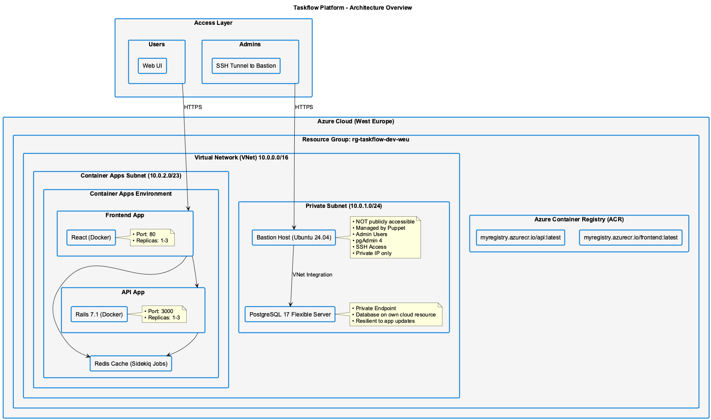
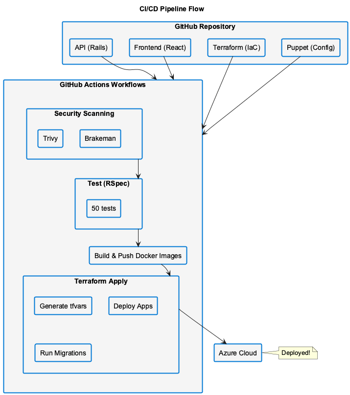

# TaskFlow Platform - Infrastructure Diagram

## Architecture Overview



*Cloud-native microservices on Azure Container Apps with private database access and Puppet-managed bastion for administration.*

## CI/CD Pipeline Flow



*Security scanning, testing, and containerized deployment via GitHub Actions and Terraform.*

## Network Security

### Access Control

| Component | Public Access | Private Access | Authentication |
|-----------|---------------|----------------|----------------|
| **Frontend** | ✅ HTTPS (Port 443) | - | - |
| **API** | ✅ HTTPS (Port 443) | - | JWT Tokens |
| **Database** | ❌ No | ✅ VNet only | PostgreSQL credentials |
| **Bastion** | ❌ No | ✅ SSH tunnel only | SSH keys |
| **pgAdmin** | ❌ No | ✅ Via bastion only | Web UI login |

### Data Flow

```
User Request → Frontend (HTTPS) → API (HTTPS) → Database (Private)
                                       ↓
                                    Redis Cache

Admin Access → SSH Tunnel → Bastion → pgAdmin → Database
```

## Component Details

### 1. Application Layer (Container Apps)

| Component | Technology | Scaling | Purpose |
|-----------|-----------|---------|---------|
| **API** | Rails 7.1 + Puma | 1-3 replicas | REST API backend |
| **Frontend** | React + Nginx | 1-3 replicas | Web UI |
| **Workers** | Sidekiq | Auto-scale | Background jobs |

### 2. Data Layer

| Component | Technology | Resilience | Backup |
|-----------|-----------|------------|--------|
| **PostgreSQL** | Postgres 17 Flexible | HA enabled | Automated daily |
| **Redis** | Azure Cache | Replicated | - |

### 3. Management Layer

| Component | Technology | Purpose | Access |
|-----------|-----------|---------|--------|
| **Bastion** | Ubuntu 24.04 | Admin access | SSH tunnel |
| **pgAdmin 4** | Web UI | DB management | Via bastion |
| **Puppet** | 8.x | Configuration | Automated |

### 4. CI/CD Layer

| Stage | Tool | Purpose |
|-------|------|---------|
| **Source Control** | GitHub | Version control |
| **CI** | GitHub Actions | Test & build |
| **CD** | Terraform | Deploy infrastructure |
| **Registry** | ACR | Container images |

## Monitoring & Observability

**Production (Azure):**
```
Application Logs → Container Apps Logs → Azure Log Analytics
                                              │
                                              ├─→ Metrics Dashboard
                                              ├─→ Alerts
                                              └─→ Application Insights
```

**Local Development:**
```
Application → OpenTelemetry Collector → Prometheus
                                    ↓
                                  Tempo (Traces)
                                    ↓
                                Grafana Dashboards
```

See [ADMINISTRATOR_GUIDE.md](ADMINISTRATOR_GUIDE.md#monitoring--alerts) for dashboard screenshots and configuration.

## Disaster Recovery

| Component | RPO | RTO | Strategy |
|-----------|-----|-----|----------|
| **Database** | 5 min | 30 min | Automated backups |
| **Containers** | 0 | 5 min | Immutable deployments |
| **Config** | 0 | 10 min | Infrastructure as Code |

## Compliance

- ✅ **Private network** for sensitive resources
- ✅ **Encrypted** connections (HTTPS, TLS)
- ✅ **Audit logs** for all changes
- ✅ **Automated** configuration management
- ✅ **Version controlled** infrastructure
